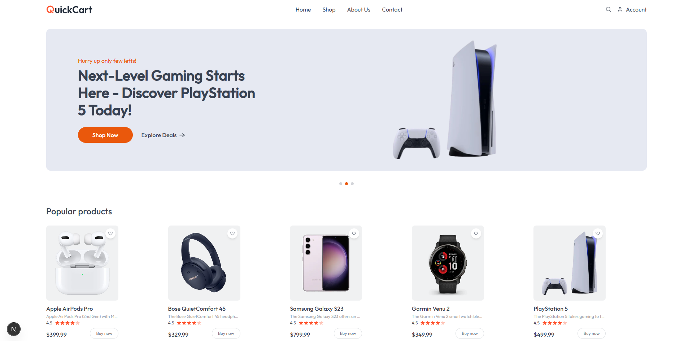
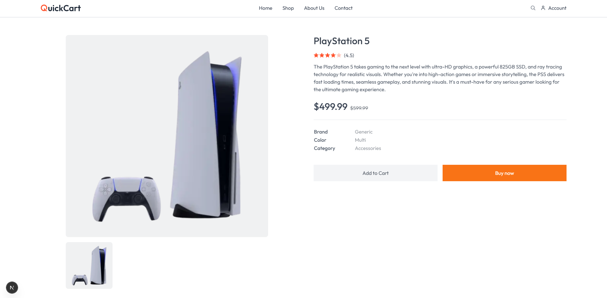
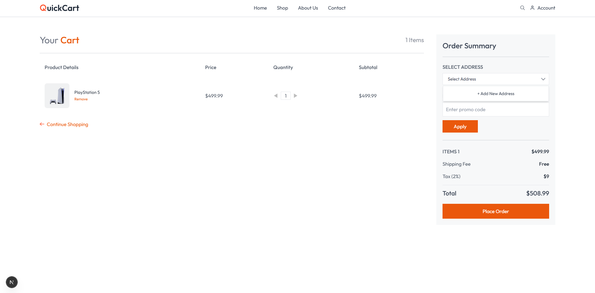
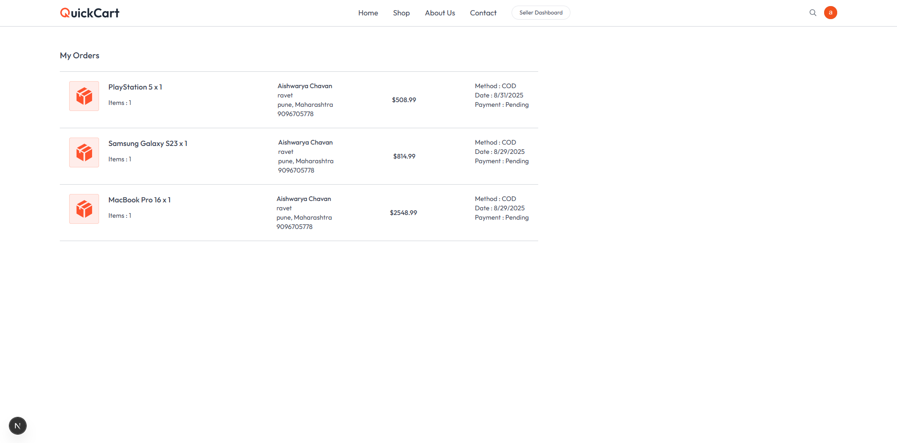
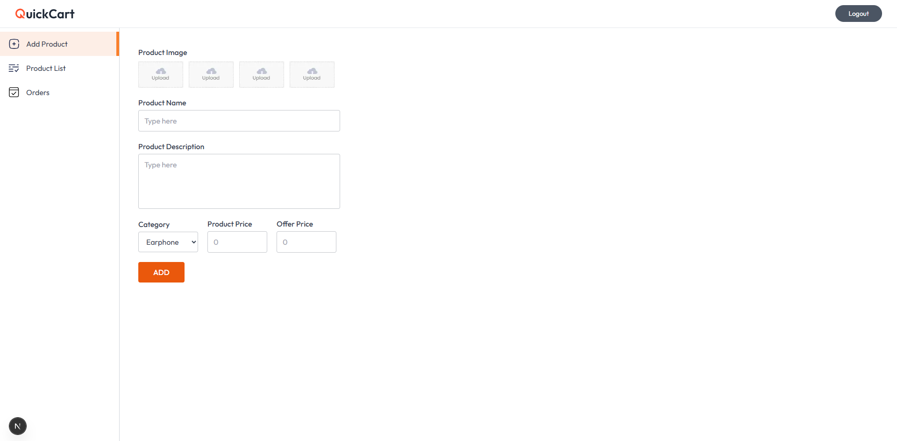

# QuickCart

**QuickCart** is a fast, responsive, and user-friendly shopping cart application built with **Next.js** and **Tailwind CSS**.

---

## 🚀 Live Demo
[View Deployment](https://quick-cart-ten-indol.vercel.app)

---

## 📖 Table of Contents
- [Overview](#overview)  
- [Tech Stack](#tech-stack)  
- [Features](#features)  
- [Screenshots](#screenshots)  
- [Getting Started](#getting-started)  
- [Usage](#usage)  
- [Folder Structure](#folder-structure)  
- [Contributing](#contributing)  
- [License](#license)

---

## 📌 Overview
QuickCart is a modern shopping cart interface designed for **speed, SEO, and great user experience**.  
It uses **Next.js App Router**, **Tailwind CSS**, and font optimization with Vercel’s Geist font.

---

## 🛠️ Tech Stack
- **Framework:** Next.js (via `create-next-app`)  
- **Styling:** Tailwind CSS  
- **Fonts:** Geist via `next/font`  
- **Deployment:** Vercel  
- **State/Backend:** (Add details if using Context API, Zustand, etc.)  

---

## ✨ Features
- Fully responsive shopping cart UI  
- Modern, lightweight design  
- SEO optimized with Next.js  
- Ready for API/backend integration  
- Easy to extend  

---

## 📸 Screenshots
*(Add your screenshots inside an `images/` folder and update the paths)*

| Page              | Preview |
|-------------------|---------|
| **Homepage**      |  |
| **Cart Page**     |  |
| **Order Page**     |  |
| **Placed Order Page**     |  |
| **Seller Dashboard**   |  |

---

## ⚡ Getting Started

First, clone the repository:

```bash
git clone https://github.com/chavanaishwarya262-spec/QuickCart.git
cd QuickCart
Install dependencies and start the development server:

bash
Copy code
npm install
npm run dev
# or
yarn
yarn dev
Open http://localhost:3000 to view the project in your browser.
You can start editing the page by modifying app/page.js. The page will auto-update as you edit the file.

🎮 Usage
Browse the homepage to view products

Add products to the cart

Modify quantity or remove items from the cart

(Add checkout flow if implemented)

📂 Folder Structure
ruby
Copy code
QuickCart/
│
├── app/                # Main app pages
│   └── page.js
├── components/         # Reusable UI components
├── context/            # State management (if used)
├── lib/                # Utility functions
├── models/             # Data models (if backend connected)
├── public/             # Static assets
├── styles/             # Global styles
├── images/             # Screenshots
├── package.json
├── tailwind.config.mjs
└── next.config.mjs
🤝 Contributing
Contributions are welcome!

Fork the repository

Create a new branch: git checkout -b feature/your-feature

Commit your changes: git commit -m "Add new feature"

Push: git push origin feature/your-feature

Open a Pull Request

📜 License
This project is licensed under the MIT License.

👩‍💻 Author
Created by Aishwarya Chavan – feel free to connect!